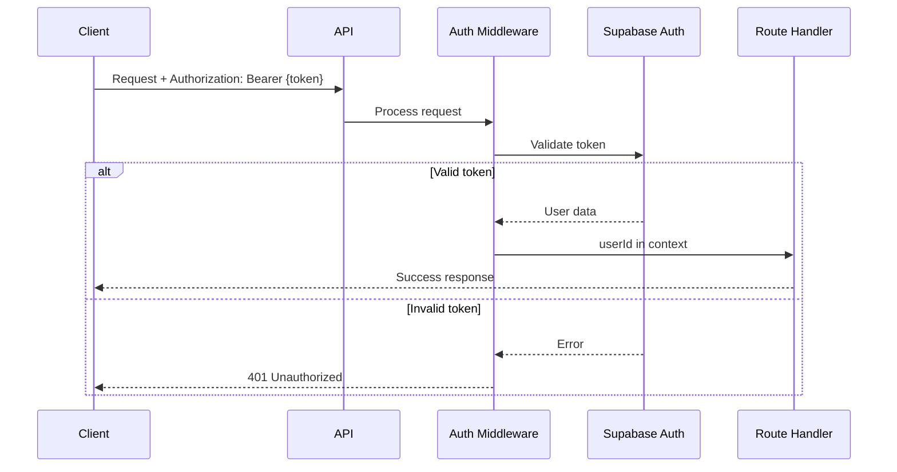
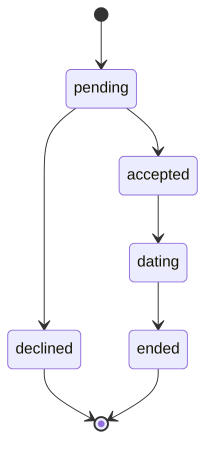

# API Documentation

## Base URL

```
# Local Development
http://localhost:3000

# Production (example)
https://your-api.railway.app
```

## Authentication

All endpoints under `/api/*` require JWT authentication via Supabase.

### Authentication Header

```http
Authorization: Bearer <jwt_token>
```

### Getting a JWT Token

1. **Via Supabase Client**
   ```typescript
   import { createClient } from '@supabase/supabase-js'

   const supabase = createClient(SUPABASE_URL, SUPABASE_ANON_KEY)

   // Sign in
   const { data, error } = await supabase.auth.signInWithPassword({
     email: 'user@example.com',
     password: 'password'
   })

   const token = data.session?.access_token
   ```

2. **Via Script** (Development)
   ```bash
   bun run get-jwt
   ```

### Authentication Flow



## Error Responses

All errors follow a consistent format:

```json
{
  "error": "Error message description"
}
```

### HTTP Status Codes

| Code | Meaning |
|------|---------|
| 200 | Success |
| 201 | Created |
| 400 | Bad Request (validation error) |
| 401 | Unauthorized (missing/invalid token) |
| 404 | Not Found |
| 500 | Internal Server Error |

## Public Endpoints

### Get API Info

Get basic API information.

```http
GET /
```

**Response**
```json
{
  "message": "Matchmaker API",
  "version": "0.1.0"
}
```

### Health Check

Check if the API is healthy.

```http
GET /health
```

**Response**
```json
{
  "status": "healthy",
  "timestamp": "2025-01-04T12:00:00.000Z"
}
```

## People Endpoints

Manage people in the matchmaking network.

### Create Person

Add a new person to your matchmaking network.

```http
POST /api/people
```

**Headers**
```
Authorization: Bearer <jwt_token>
Content-Type: application/json
```

**Request Body**
```json
{
  "name": "John Doe",
  "age": 28,
  "location": "San Francisco, CA",
  "gender": "male",
  "preferences": {
    "age_range": [25, 35],
    "interests": ["hiking", "cooking", "tech"]
  },
  "personality": {
    "myers_briggs": "INTJ",
    "traits": ["introverted", "analytical"]
  },
  "notes": "Looking for long-term relationship"
}
```

**Validation Rules**
- `name` (required): Non-empty string
- `age` (optional): Positive integer
- `location` (optional): String
- `gender` (optional): String
- `preferences` (optional): JSON object
- `personality` (optional): JSON object
- `notes` (optional): String

**Response** `201 Created`
```json
{
  "id": "550e8400-e29b-41d4-a716-446655440000",
  "matchmaker_id": "7c9e6679-7425-40de-944b-e07fc1f90ae7",
  "name": "John Doe",
  "age": 28,
  "location": "San Francisco, CA",
  "gender": "male",
  "preferences": {
    "age_range": [25, 35],
    "interests": ["hiking", "cooking", "tech"]
  },
  "personality": {
    "myers_briggs": "INTJ",
    "traits": ["introverted", "analytical"]
  },
  "notes": "Looking for long-term relationship",
  "active": true,
  "created_at": "2025-01-04T12:00:00.000Z",
  "updated_at": "2025-01-04T12:00:00.000Z"
}
```

**Error Response** `400 Bad Request`
```json
{
  "error": "Validation error message"
}
```

### List All People

Get all people in your network.

```http
GET /api/people
```

**Headers**
```
Authorization: Bearer <jwt_token>
```

**Response** `200 OK`
```json
[
  {
    "id": "550e8400-e29b-41d4-a716-446655440000",
    "matchmaker_id": "7c9e6679-7425-40de-944b-e07fc1f90ae7",
    "name": "John Doe",
    "age": 28,
    "location": "San Francisco, CA",
    "gender": "male",
    "preferences": { "age_range": [25, 35] },
    "personality": { "myers_briggs": "INTJ" },
    "notes": "Looking for long-term relationship",
    "active": true,
    "created_at": "2025-01-04T12:00:00.000Z",
    "updated_at": "2025-01-04T12:00:00.000Z"
  },
  {
    "id": "650e8400-e29b-41d4-a716-446655440001",
    "matchmaker_id": "7c9e6679-7425-40de-944b-e07fc1f90ae7",
    "name": "Jane Smith",
    "age": 26,
    "location": "San Francisco, CA",
    "gender": "female",
    "preferences": null,
    "personality": null,
    "notes": null,
    "active": true,
    "created_at": "2025-01-04T13:00:00.000Z",
    "updated_at": "2025-01-04T13:00:00.000Z"
  }
]
```

### Get Person by ID

Get a specific person's details.

```http
GET /api/people/:id
```

**Headers**
```
Authorization: Bearer <jwt_token>
```

**Parameters**
- `id` (path): UUID of the person

**Response** `200 OK`
```json
{
  "id": "550e8400-e29b-41d4-a716-446655440000",
  "matchmaker_id": "7c9e6679-7425-40de-944b-e07fc1f90ae7",
  "name": "John Doe",
  "age": 28,
  "location": "San Francisco, CA",
  "gender": "male",
  "preferences": { "age_range": [25, 35] },
  "personality": { "myers_briggs": "INTJ" },
  "notes": "Looking for long-term relationship",
  "active": true,
  "created_at": "2025-01-04T12:00:00.000Z",
  "updated_at": "2025-01-04T12:00:00.000Z"
}
```

**Error Response** `404 Not Found`
```json
{
  "error": "Person not found"
}
```

### Update Person

Update a person's information.

```http
PUT /api/people/:id
```

**Headers**
```
Authorization: Bearer <jwt_token>
Content-Type: application/json
```

**Parameters**
- `id` (path): UUID of the person

**Request Body**
```json
{
  "age": 29,
  "notes": "Updated: Now interested in short-term dating"
}
```

**Validation Rules**
All fields are optional:
- `name`: Non-empty string
- `age`: Positive integer
- `location`: String
- `gender`: String
- `preferences`: JSON object
- `personality`: JSON object
- `notes`: String

**Response** `200 OK`
```json
{
  "id": "550e8400-e29b-41d4-a716-446655440000",
  "matchmaker_id": "7c9e6679-7425-40de-944b-e07fc1f90ae7",
  "name": "John Doe",
  "age": 29,
  "location": "San Francisco, CA",
  "gender": "male",
  "preferences": { "age_range": [25, 35] },
  "personality": { "myers_briggs": "INTJ" },
  "notes": "Updated: Now interested in short-term dating",
  "active": true,
  "created_at": "2025-01-04T12:00:00.000Z",
  "updated_at": "2025-01-04T14:00:00.000Z"
}
```

**Error Response** `404 Not Found`
```json
{
  "error": "Person not found"
}
```

### Delete Person (Soft Delete)

Deactivate a person (soft delete - sets active=false).

```http
DELETE /api/people/:id
```

**Headers**
```
Authorization: Bearer <jwt_token>
```

**Parameters**
- `id` (path): UUID of the person

**Response** `200 OK`
```json
{
  "id": "550e8400-e29b-41d4-a716-446655440000",
  "matchmaker_id": "7c9e6679-7425-40de-944b-e07fc1f90ae7",
  "name": "John Doe",
  "age": 29,
  "location": "San Francisco, CA",
  "gender": "male",
  "preferences": { "age_range": [25, 35] },
  "personality": { "myers_briggs": "INTJ" },
  "notes": "Updated: Now interested in short-term dating",
  "active": false,
  "created_at": "2025-01-04T12:00:00.000Z",
  "updated_at": "2025-01-04T15:00:00.000Z"
}
```

**Error Response** `404 Not Found`
```json
{
  "error": "Person not found"
}
```

## Introductions Endpoints

Manage introductions between people.

### Create Introduction

Create an introduction between two people.

```http
POST /api/introductions
```

**Headers**
```
Authorization: Bearer <jwt_token>
Content-Type: application/json
```

**Request Body**
```json
{
  "person_a_id": "550e8400-e29b-41d4-a716-446655440000",
  "person_b_id": "650e8400-e29b-41d4-a716-446655440001",
  "notes": "Both love hiking and tech. Great compatibility!"
}
```

**Validation Rules**
- `person_a_id` (required): Valid UUID
- `person_b_id` (required): Valid UUID (must be different from person_a_id)
- `notes` (optional): String

**Response** `201 Created`
```json
{
  "id": "750e8400-e29b-41d4-a716-446655440002",
  "matchmaker_id": "7c9e6679-7425-40de-944b-e07fc1f90ae7",
  "person_a_id": "550e8400-e29b-41d4-a716-446655440000",
  "person_b_id": "650e8400-e29b-41d4-a716-446655440001",
  "status": "pending",
  "notes": "Both love hiking and tech. Great compatibility!",
  "created_at": "2025-01-04T12:00:00.000Z",
  "updated_at": "2025-01-04T12:00:00.000Z"
}
```

**Error Response** `400 Bad Request`
```json
{
  "error": "Cannot introduce a person to themselves"
}
```

### List All Introductions

Get all introductions you've created.

```http
GET /api/introductions
```

**Headers**
```
Authorization: Bearer <jwt_token>
```

**Response** `200 OK`
```json
[
  {
    "id": "750e8400-e29b-41d4-a716-446655440002",
    "matchmaker_id": "7c9e6679-7425-40de-944b-e07fc1f90ae7",
    "person_a_id": "550e8400-e29b-41d4-a716-446655440000",
    "person_b_id": "650e8400-e29b-41d4-a716-446655440001",
    "status": "pending",
    "notes": "Both love hiking and tech. Great compatibility!",
    "created_at": "2025-01-04T12:00:00.000Z",
    "updated_at": "2025-01-04T12:00:00.000Z"
  },
  {
    "id": "850e8400-e29b-41d4-a716-446655440003",
    "matchmaker_id": "7c9e6679-7425-40de-944b-e07fc1f90ae7",
    "person_a_id": "550e8400-e29b-41d4-a716-446655440000",
    "person_b_id": "950e8400-e29b-41d4-a716-446655440004",
    "status": "dating",
    "notes": null,
    "created_at": "2025-01-03T12:00:00.000Z",
    "updated_at": "2025-01-03T18:00:00.000Z"
  }
]
```

### Get Introduction by ID

Get a specific introduction's details.

```http
GET /api/introductions/:id
```

**Headers**
```
Authorization: Bearer <jwt_token>
```

**Parameters**
- `id` (path): UUID of the introduction

**Response** `200 OK`
```json
{
  "id": "750e8400-e29b-41d4-a716-446655440002",
  "matchmaker_id": "7c9e6679-7425-40de-944b-e07fc1f90ae7",
  "person_a_id": "550e8400-e29b-41d4-a716-446655440000",
  "person_b_id": "650e8400-e29b-41d4-a716-446655440001",
  "status": "pending",
  "notes": "Both love hiking and tech. Great compatibility!",
  "created_at": "2025-01-04T12:00:00.000Z",
  "updated_at": "2025-01-04T12:00:00.000Z"
}
```

**Error Response** `404 Not Found`
```json
{
  "error": "Introduction not found"
}
```

### Update Introduction

Update an introduction's status or notes.

```http
PUT /api/introductions/:id
```

**Headers**
```
Authorization: Bearer <jwt_token>
Content-Type: application/json
```

**Parameters**
- `id` (path): UUID of the introduction

**Request Body**
```json
{
  "status": "accepted",
  "notes": "They both agreed to meet for coffee!"
}
```

**Validation Rules**
All fields are optional:
- `status`: One of: `pending`, `accepted`, `declined`, `dating`, `ended`
- `notes`: String

**Response** `200 OK`
```json
{
  "id": "750e8400-e29b-41d4-a716-446655440002",
  "matchmaker_id": "7c9e6679-7425-40de-944b-e07fc1f90ae7",
  "person_a_id": "550e8400-e29b-41d4-a716-446655440000",
  "person_b_id": "650e8400-e29b-41d4-a716-446655440001",
  "status": "accepted",
  "notes": "They both agreed to meet for coffee!",
  "created_at": "2025-01-04T12:00:00.000Z",
  "updated_at": "2025-01-04T13:00:00.000Z"
}
```

**Introduction Status Lifecycle**


## Feedback Endpoints

Manage feedback about introductions.

### Create Feedback

Add feedback for an introduction.

```http
POST /api/feedback
```

**Headers**
```
Authorization: Bearer <jwt_token>
Content-Type: application/json
```

**Request Body**
```json
{
  "introduction_id": "750e8400-e29b-41d4-a716-446655440002",
  "from_person_id": "550e8400-e29b-41d4-a716-446655440000",
  "content": "Had a great time! We're planning a second date.",
  "sentiment": "positive"
}
```

**Validation Rules**
- `introduction_id` (required): Valid UUID
- `from_person_id` (required): Valid UUID
- `content` (required): Non-empty string
- `sentiment` (optional): String (e.g., "positive", "negative", "neutral")

**Response** `201 Created`
```json
{
  "id": "a50e8400-e29b-41d4-a716-446655440005",
  "introduction_id": "750e8400-e29b-41d4-a716-446655440002",
  "from_person_id": "550e8400-e29b-41d4-a716-446655440000",
  "content": "Had a great time! We're planning a second date.",
  "sentiment": "positive",
  "created_at": "2025-01-04T15:00:00.000Z"
}
```

### List Feedback for Introduction

Get all feedback for a specific introduction.

```http
GET /api/feedback?introductionId=<uuid>
```

**Headers**
```
Authorization: Bearer <jwt_token>
```

**Query Parameters**
- `introductionId` (required): UUID of the introduction

**Response** `200 OK`
```json
[
  {
    "id": "a50e8400-e29b-41d4-a716-446655440005",
    "introduction_id": "750e8400-e29b-41d4-a716-446655440002",
    "from_person_id": "550e8400-e29b-41d4-a716-446655440000",
    "content": "Had a great time! We're planning a second date.",
    "sentiment": "positive",
    "created_at": "2025-01-04T15:00:00.000Z"
  },
  {
    "id": "b50e8400-e29b-41d4-a716-446655440006",
    "introduction_id": "750e8400-e29b-41d4-a716-446655440002",
    "from_person_id": "650e8400-e29b-41d4-a716-446655440001",
    "content": "Really enjoyed meeting them! Looking forward to the next time.",
    "sentiment": "positive",
    "created_at": "2025-01-04T16:00:00.000Z"
  }
]
```

**Error Response** `400 Bad Request`
```json
{
  "error": "introductionId query parameter required"
}
```

### Get Feedback by ID

Get a specific feedback entry.

```http
GET /api/feedback/:id
```

**Headers**
```
Authorization: Bearer <jwt_token>
```

**Parameters**
- `id` (path): UUID of the feedback

**Response** `200 OK`
```json
{
  "id": "a50e8400-e29b-41d4-a716-446655440005",
  "introduction_id": "750e8400-e29b-41d4-a716-446655440002",
  "from_person_id": "550e8400-e29b-41d4-a716-446655440000",
  "content": "Had a great time! We're planning a second date.",
  "sentiment": "positive",
  "created_at": "2025-01-04T15:00:00.000Z"
}
```

**Error Response** `404 Not Found`
```json
{
  "error": "Feedback not found"
}
```

## Matches Endpoints

Find potential matches for people.

### Get Matches for Person

Get potential matches for a specific person using the matching algorithm.

```http
GET /api/matches/:personId
```

**Headers**
```
Authorization: Bearer <jwt_token>
```

**Parameters**
- `personId` (path): UUID of the person to find matches for

**Response** `200 OK`
```json
[]
```

**Note**: The matching algorithm is currently a placeholder that returns an empty array. Future implementation will consider:
- Age preferences
- Location proximity
- Personality compatibility
- Shared interests/preferences
- Historical feedback sentiment

**Planned Response Structure**
```json
[
  {
    "person": {
      "id": "650e8400-e29b-41d4-a716-446655440001",
      "name": "Jane Smith",
      "age": 26,
      "location": "San Francisco, CA"
    },
    "compatibility_score": 0.85,
    "match_reasons": [
      "Similar age range",
      "Same location",
      "Shared interest: hiking"
    ]
  }
]
```

**Error Responses**

`404 Not Found`
```json
{
  "error": "Person not found"
}
```

`500 Internal Server Error`
```json
{
  "error": "Database error message"
}
```

## Rate Limiting

Rate limiting is managed by Supabase:
- **Email**: 2 per hour
- **Token refresh**: 150 per 5 minutes
- **Sign in/up**: 30 per 5 minutes

For custom rate limiting on the API level, consider implementing middleware or using a service like Cloudflare.

## CORS Configuration

The API has CORS enabled for all origins in development. For production, configure specific origins:

```typescript
app.use('*', cors({
  origin: ['https://yourdomain.com'],
  credentials: true
}))
```

## Pagination

Currently, all list endpoints return all results. Future implementation will include pagination:

```http
GET /api/people?page=1&limit=20
```

## Filtering & Sorting

Future endpoints will support filtering and sorting:

```http
# Filter by active status
GET /api/people?active=true

# Sort by creation date
GET /api/people?sort=created_at&order=desc
```

## API Client Example (TypeScript)

```typescript
class MatchmakerClient {
  private baseURL: string
  private token: string

  constructor(baseURL: string, token: string) {
    this.baseURL = baseURL
    this.token = token
  }

  private async request<T>(
    method: string,
    path: string,
    body?: unknown
  ): Promise<T> {
    const response = await fetch(`${this.baseURL}${path}`, {
      method,
      headers: {
        'Authorization': `Bearer ${this.token}`,
        'Content-Type': 'application/json',
      },
      body: body ? JSON.stringify(body) : undefined,
    })

    if (!response.ok) {
      const error = await response.json()
      throw new Error(error.error || 'Request failed')
    }

    return response.json()
  }

  // People
  async createPerson(data: CreatePersonInput) {
    return this.request('POST', '/api/people', data)
  }

  async listPeople() {
    return this.request('GET', '/api/people')
  }

  async getPerson(id: string) {
    return this.request('GET', `/api/people/${id}`)
  }

  async updatePerson(id: string, data: UpdatePersonInput) {
    return this.request('PUT', `/api/people/${id}`, data)
  }

  async deletePerson(id: string) {
    return this.request('DELETE', `/api/people/${id}`)
  }

  // Introductions
  async createIntroduction(data: CreateIntroductionInput) {
    return this.request('POST', '/api/introductions', data)
  }

  async listIntroductions() {
    return this.request('GET', '/api/introductions')
  }

  async getIntroduction(id: string) {
    return this.request('GET', `/api/introductions/${id}`)
  }

  async updateIntroduction(id: string, data: UpdateIntroductionInput) {
    return this.request('PUT', `/api/introductions/${id}`, data)
  }

  // Feedback
  async createFeedback(data: CreateFeedbackInput) {
    return this.request('POST', '/api/feedback', data)
  }

  async listFeedback(introductionId: string) {
    return this.request('GET', `/api/feedback?introductionId=${introductionId}`)
  }

  async getFeedback(id: string) {
    return this.request('GET', `/api/feedback/${id}`)
  }

  // Matches
  async getMatches(personId: string) {
    return this.request('GET', `/api/matches/${personId}`)
  }
}

// Usage
const client = new MatchmakerClient(
  'https://your-api.railway.app',
  'your-jwt-token'
)

const person = await client.createPerson({
  name: 'John Doe',
  age: 28
})
```

## Testing with cURL

### Create a person
```bash
curl -X POST https://your-api.railway.app/api/people \
  -H "Authorization: Bearer YOUR_JWT_TOKEN" \
  -H "Content-Type: application/json" \
  -d '{
    "name": "John Doe",
    "age": 28,
    "location": "San Francisco, CA"
  }'
```

### List all people
```bash
curl https://your-api.railway.app/api/people \
  -H "Authorization: Bearer YOUR_JWT_TOKEN"
```

### Update a person
```bash
curl -X PUT https://your-api.railway.app/api/people/PERSON_ID \
  -H "Authorization: Bearer YOUR_JWT_TOKEN" \
  -H "Content-Type: application/json" \
  -d '{
    "age": 29
  }'
```

### Create an introduction
```bash
curl -X POST https://your-api.railway.app/api/introductions \
  -H "Authorization: Bearer YOUR_JWT_TOKEN" \
  -H "Content-Type: application/json" \
  -d '{
    "person_a_id": "PERSON_A_UUID",
    "person_b_id": "PERSON_B_UUID",
    "notes": "Great match!"
  }'
```

## Webhooks (Planned)

Future implementation will include webhooks for events:

```typescript
// Webhook payload structure
{
  "event": "introduction.created",
  "timestamp": "2025-01-04T12:00:00.000Z",
  "data": {
    "id": "750e8400-e29b-41d4-a716-446655440002",
    "matchmaker_id": "7c9e6679-7425-40de-944b-e07fc1f90ae7",
    "person_a_id": "550e8400-e29b-41d4-a716-446655440000",
    "person_b_id": "650e8400-e29b-41d4-a716-446655440001",
    "status": "pending"
  }
}
```

Planned webhook events:
- `introduction.created`
- `introduction.updated`
- `feedback.created`
- `match.found`
