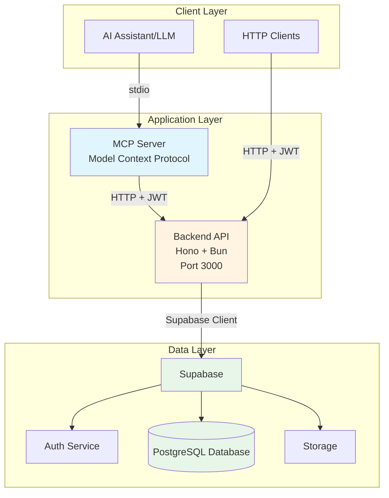
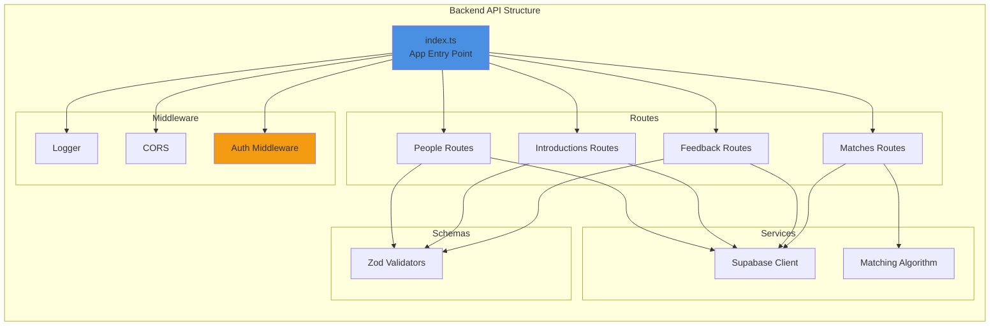
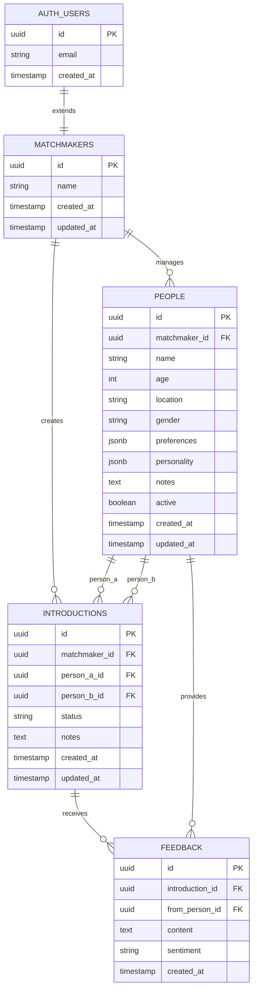
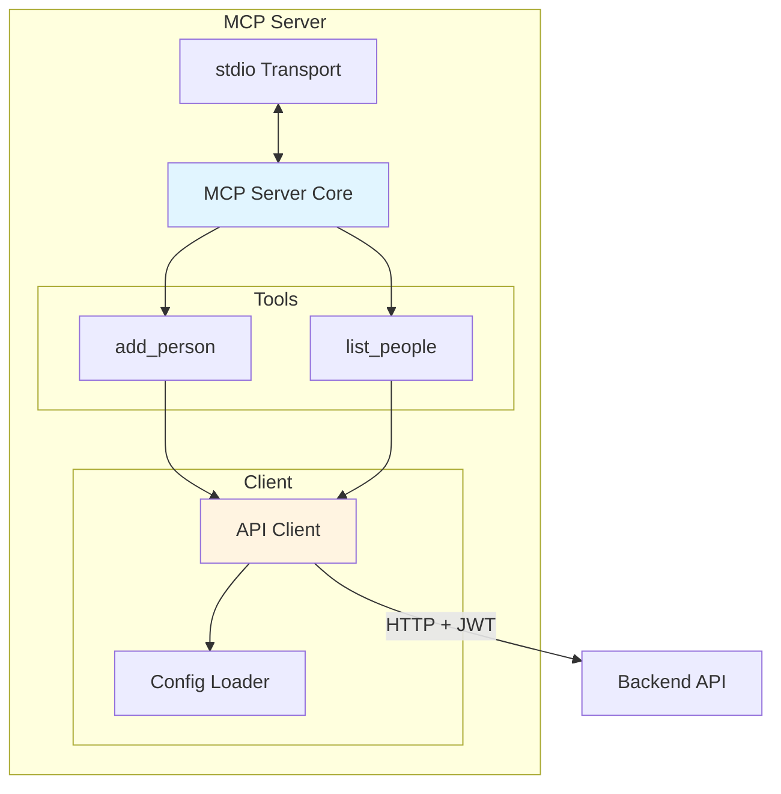
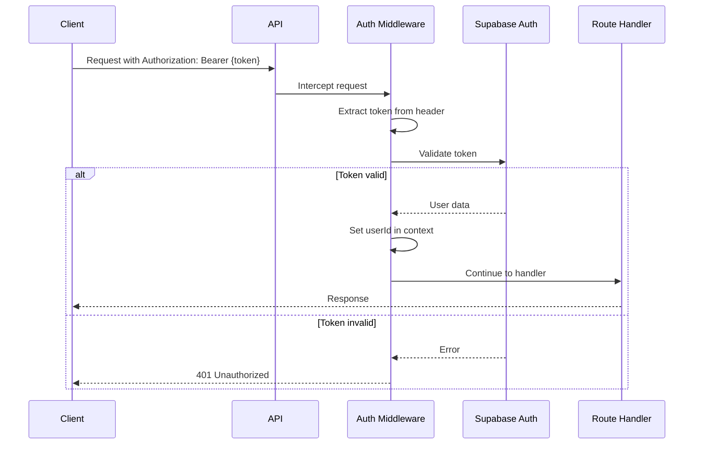
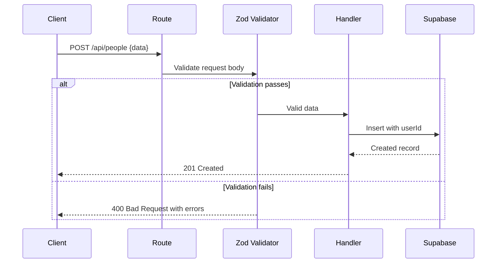

# Matchmaker System Architecture

## Overview

The Matchmaker system is an AI-powered matchmaking platform that helps matchmakers manage people, create introductions, track feedback, and find compatible matches. The system consists of three main components:

1. **Backend API** - RESTful API built with Hono and Bun
2. **Supabase** - PostgreSQL database with authentication and Row Level Security
3. **MCP Server** - Model Context Protocol server for AI integration

## System Architecture Diagram



## Component Architecture

### Backend API (Hono + Bun)

The backend is a lightweight, high-performance REST API.



**Key Features:**

- **Middleware Stack**: Logger, CORS, and JWT Authentication
- **Zod Validation**: Type-safe request validation on all endpoints
- **Service Layer**: Matching algorithm and database client abstraction
- **Environment-based Config**: Graceful handling of missing Supabase credentials

### Database Schema (Supabase/PostgreSQL)



**Security Features:**

- **Row Level Security (RLS)**: All tables protected with RLS policies
- **Authentication**: Built on Supabase Auth (extends auth.users)
- **Data Isolation**: Matchmakers can only access their own data
- **Referential Integrity**: Cascading deletes and foreign key constraints

### MCP Server (AI Integration)

The MCP server provides AI assistants with tools to interact with the matchmaker system.



**Capabilities:**

- **Tool Interface**: Exposes `add_person` and `list_people` tools
- **Authentication**: Uses JWT token from config
- **Validation**: Zod schema validation for API responses
- **Error Handling**: Graceful error propagation to AI assistant

## Data Flow Patterns

### Authentication Flow



### Request Validation Flow



## Technology Stack

### Runtime & Framework

- **Bun**: Fast all-in-one JavaScript runtime
- **Hono**: Ultra-fast web framework (3.5KB)
- **TypeScript**: Type-safe development

### Database & Auth

- **Supabase**: PostgreSQL with built-in auth and real-time
- **Row Level Security**: Database-level authorization
- **PostgreSQL 17**: Latest stable release

### Validation & Type Safety

- **Zod**: Runtime type validation
- **@hono/zod-validator**: Integration with Hono

### AI Integration

- **@modelcontextprotocol/sdk**: MCP server implementation
- **stdio Transport**: Communication with AI assistants

## Design Principles

### 1. Security First

- JWT authentication on all protected routes
- Row Level Security at database level
- No data leakage between matchmakers
- Soft deletes (active flag) for data retention

### 2. Type Safety

- End-to-end TypeScript
- Zod schemas for runtime validation
- Type inference from schemas

### 3. Performance

- Bun runtime for speed
- Hono for minimal overhead
- Database indexes on foreign keys
- Efficient query patterns

### 4. Developer Experience

- Hot reload in development
- Comprehensive test coverage
- Clear separation of concerns
- Conventional commits

### 5. Extensibility

- Modular route structure
- Pluggable services
- MCP tools easily added
- Future-ready matching algorithm

## File Structure

```
matchmaker/
├── backend/
│   └── src/
│       ├── index.ts              # App entry point
│       ├── middleware/
│       │   └── auth.ts           # JWT authentication
│       ├── routes/
│       │   ├── people.ts         # CRUD for people
│       │   ├── introductions.ts  # CRUD for introductions
│       │   ├── feedback.ts       # CRUD for feedback
│       │   └── matches.ts        # Matching algorithm
│       ├── schemas/
│       │   ├── people.ts         # Zod schemas
│       │   ├── introductions.ts
│       │   ├── feedback.ts
│       │   └── matches.ts
│       ├── services/
│       │   └── matchingAlgorithm.ts  # Match finder
│       └── lib/
│           ├── supabase.ts       # Supabase client
│           └── utils.ts          # Utilities
├── mcp-server/
│   └── src/
│       ├── index.ts              # MCP server entry
│       ├── api.ts                # API client
│       ├── config.ts             # Config loader
│       └── schemas.ts            # Response validators
├── supabase/
│   ├── config.toml               # Supabase local config
│   ├── migrations/
│   │   ├── 20251229000000_init_matchmaker_schema.sql
│   │   └── 20251229_add_missing_schema.sql
│   └── seed.sql                  # Seed data
└── docs/
    ├── ARCHITECTURE.md           # This file
    ├── DEPLOYMENT.md
    ├── API.md
    ├── DATABASE.md
    └── FLOWS.md
```

## Key Design Decisions

### Why Hono?

- Minimal overhead (3.5KB)
- Works perfectly with Bun
- Clean middleware system
- Excellent TypeScript support

### Why Supabase?

- PostgreSQL with batteries included
- Built-in authentication
- Row Level Security
- Real-time capabilities (future use)
- Great local development experience

### Why MCP?

- Standard protocol for AI tool integration
- Allows any AI assistant to use the system
- Clean separation between AI and business logic
- Future-proof for multi-modal AI

### Why Soft Deletes?

- Maintains referential integrity
- Allows for data recovery
- Preserves historical context
- Better for auditing

## Future Enhancements

### Planned Features

1. **Advanced Matching Algorithm**

   - Personality compatibility scoring
   - Location-based filtering
   - Age preference matching
   - Historical feedback analysis

2. **Real-time Updates**

   - Supabase real-time subscriptions
   - Live introduction status updates
   - Push notifications

3. **Analytics Dashboard**

   - Success rate tracking
   - Matchmaker performance metrics
   - People activity insights

4. **Enhanced MCP Tools**

   - Create introductions via AI
   - Update introduction status
   - Query feedback sentiment
   - Get match recommendations

5. **Multi-tenant Support**
   - Organizations with multiple matchmakers
   - Team collaboration features
   - Shared people pools

## Performance Considerations

### Database Optimization

- Indexes on `matchmaker_id` for all tables
- Index on `people.active` for filtering
- Composite index on `introductions(person_a_id, person_b_id)`
- `updated_at` triggers for automatic timestamps

### API Optimization

- Minimal middleware chain
- Direct Supabase client (no ORM overhead)
- Single query per endpoint when possible
- Proper HTTP status codes for caching

### Scalability

- Stateless API (horizontally scalable)
- Connection pooling via Supabase
- Bun's performance characteristics
- Database-level authorization (reduced app logic)

## Security Considerations

### Authentication

- JWT tokens with expiration
- Supabase handles token refresh
- Bearer token in Authorization header
- No session storage needed

### Authorization

- Row Level Security enforces data isolation
- Database validates all access
- Middleware validates token
- User ID from JWT, not request body

### Input Validation

- Zod schemas on all inputs
- SQL injection protection via parameterized queries
- XSS protection via JSON responses
- CORS configured for security

## Testing Strategy

### Backend Tests

- Unit tests for matching algorithm
- Integration tests for routes
- Middleware tests for auth
- Schema validation tests

### MCP Server Tests

- Tool handler tests
- API client tests
- Config validation tests
- Error handling tests

### Database Tests

- RLS policy tests
- Migration tests
- Trigger tests
- Constraint tests
