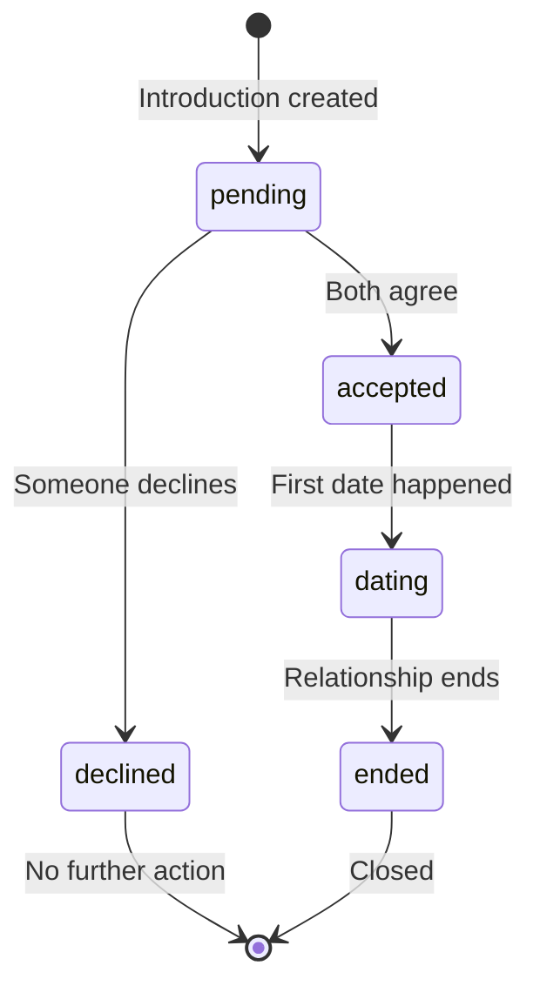
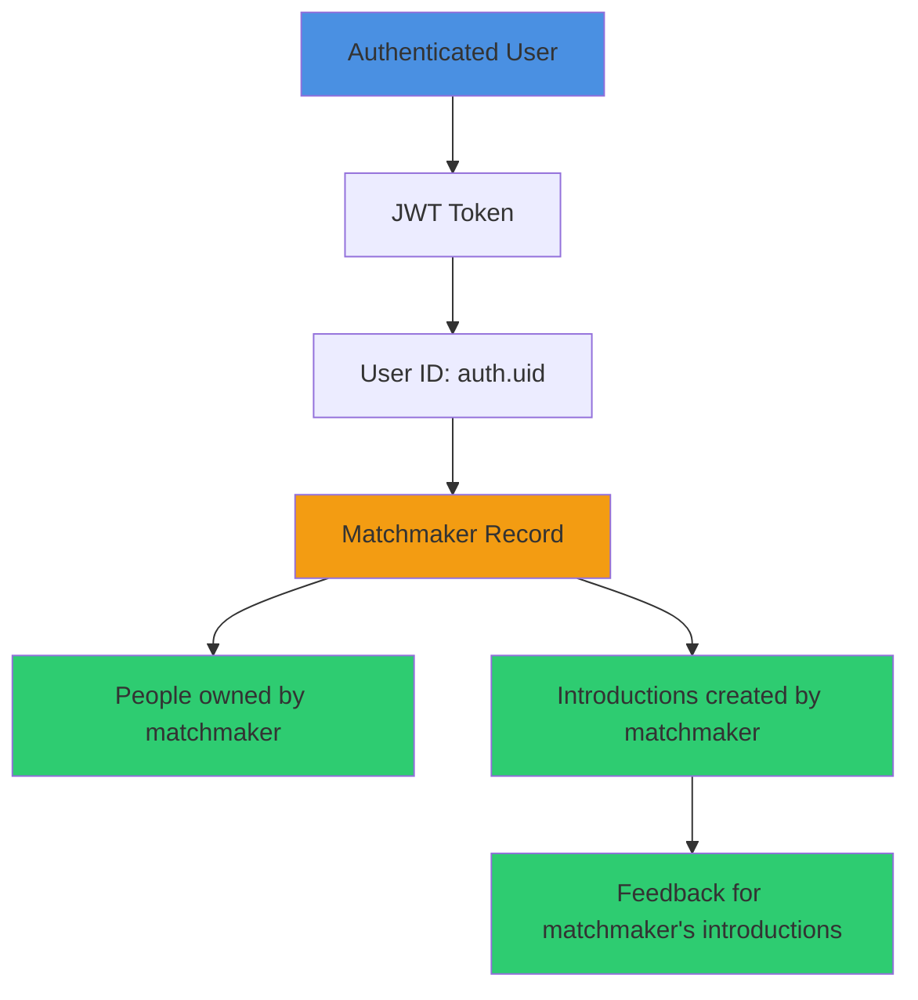
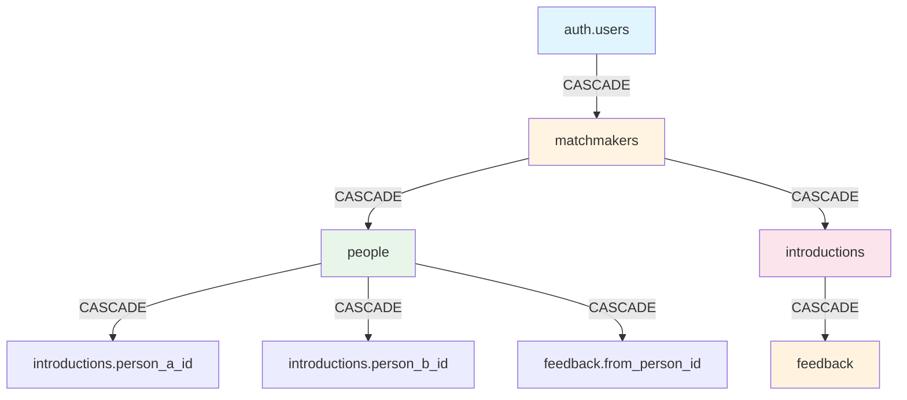

# Database Documentation

## Overview

The Matchmaker system uses PostgreSQL 17 via Supabase, with comprehensive Row Level Security (RLS) policies to ensure data isolation between matchmakers.

## Schema Diagram

```mermaid
erDiagram
    AUTH_USERS ||--|| MATCHMAKERS : "extends (1:1)"
    MATCHMAKERS ||--o{ PEOPLE : "manages (1:N)"
    MATCHMAKERS ||--o{ INTRODUCTIONS : "creates (1:N)"
    PEOPLE ||--o{ INTRODUCTIONS_A : "person_a (1:N)"
    PEOPLE ||--o{ INTRODUCTIONS_B : "person_b (1:N)"
    INTRODUCTIONS ||--o{ FEEDBACK : "receives (1:N)"
    PEOPLE ||--o{ FEEDBACK : "provides (1:N)"

    AUTH_USERS {
        uuid id PK "Supabase auth user ID"
        string email UK "User email address"
        string encrypted_password "Hashed password"
        timestamp email_confirmed_at "Email verification time"
        timestamp created_at "Account creation time"
        timestamp updated_at "Last update time"
    }

    MATCHMAKERS {
        uuid id PK-FK "References auth.users(id)"
        string name "Matchmaker's name"
        timestamp created_at "Record creation time"
        timestamp updated_at "Last update time"
    }

    PEOPLE {
        uuid id PK "Unique person ID"
        uuid matchmaker_id FK "Owner matchmaker"
        string name "Person's name"
        int age "Person's age"
        string location "Geographic location"
        string gender "Gender identity"
        jsonb preferences "Dating preferences"
        jsonb personality "Personality data"
        text notes "Matchmaker notes"
        boolean active "Active status"
        timestamp created_at "Record creation time"
        timestamp updated_at "Last update time"
    }

    INTRODUCTIONS {
        uuid id PK "Unique introduction ID"
        uuid matchmaker_id FK "Creator matchmaker"
        uuid person_a_id FK "First person"
        uuid person_b_id FK "Second person"
        string status "Introduction status"
        text notes "Matchmaker notes"
        timestamp created_at "Introduction time"
        timestamp updated_at "Last update time"
    }

    FEEDBACK {
        uuid id PK "Unique feedback ID"
        uuid introduction_id FK "Related introduction"
        uuid from_person_id FK "Feedback author"
        text content "Feedback text"
        string sentiment "Sentiment analysis"
        timestamp created_at "Feedback time"
    }
```

## Table Details

### auth.users (Supabase Managed)

Built-in Supabase authentication table. Not directly modified by the application.

**Key Columns:**
- `id` (uuid): Primary key, used as matchmaker ID
- `email` (string): Unique email address
- `encrypted_password` (string): Hashed password
- `email_confirmed_at` (timestamp): Email verification status
- `created_at`, `updated_at` (timestamp): Timestamps

**Managed By:** Supabase Auth service

### public.matchmakers

Extends `auth.users` with matchmaker-specific information.

```sql
CREATE TABLE public.matchmakers (
  id UUID NOT NULL REFERENCES auth.users(id) ON DELETE CASCADE,
  name VARCHAR(255) NOT NULL,
  created_at TIMESTAMP WITH TIME ZONE DEFAULT NOW() NOT NULL,
  updated_at TIMESTAMP WITH TIME ZONE DEFAULT NOW() NOT NULL,
  PRIMARY KEY (id)
);
```

**Columns:**

| Column | Type | Nullable | Default | Description |
|--------|------|----------|---------|-------------|
| id | UUID | NO | - | References auth.users(id) |
| name | VARCHAR(255) | NO | - | Matchmaker's display name |
| created_at | TIMESTAMPTZ | NO | NOW() | Record creation time |
| updated_at | TIMESTAMPTZ | NO | NOW() | Auto-updated on changes |

**Indexes:**
- Primary key on `id`

**Triggers:**
- `update_matchmakers_updated_at`: Auto-updates `updated_at` on UPDATE

**Relationships:**
- **Parent**: `auth.users` (1:1, ON DELETE CASCADE)
- **Children**: `people` (1:N), `introductions` (1:N)

### public.people

Stores individuals in the matchmaking network.

```sql
CREATE TABLE public.people (
  id UUID PRIMARY KEY DEFAULT gen_random_uuid(),
  matchmaker_id UUID NOT NULL REFERENCES public.matchmakers(id) ON DELETE CASCADE,
  name VARCHAR(255) NOT NULL,
  age INTEGER,
  location VARCHAR(255),
  gender VARCHAR(50),
  preferences JSONB,
  personality JSONB,
  notes TEXT,
  active BOOLEAN DEFAULT true NOT NULL,
  created_at TIMESTAMP WITH TIME ZONE DEFAULT NOW() NOT NULL,
  updated_at TIMESTAMP WITH TIME ZONE DEFAULT NOW() NOT NULL
);
```

**Columns:**

| Column | Type | Nullable | Default | Description |
|--------|------|----------|---------|-------------|
| id | UUID | NO | gen_random_uuid() | Unique person ID |
| matchmaker_id | UUID | NO | - | Owner matchmaker |
| name | VARCHAR(255) | NO | - | Person's full name |
| age | INTEGER | YES | NULL | Person's age |
| location | VARCHAR(255) | YES | NULL | City, state, or region |
| gender | VARCHAR(50) | YES | NULL | Gender identity |
| preferences | JSONB | YES | NULL | Dating preferences (flexible JSON) |
| personality | JSONB | YES | NULL | Personality data (flexible JSON) |
| notes | TEXT | YES | NULL | Matchmaker's private notes |
| active | BOOLEAN | NO | true | Active status (soft delete) |
| created_at | TIMESTAMPTZ | NO | NOW() | Record creation time |
| updated_at | TIMESTAMPTZ | NO | NOW() | Auto-updated on changes |

**Indexes:**
- Primary key on `id`
- `idx_people_matchmaker_id` on `matchmaker_id` (for filtering by matchmaker)
- `idx_people_active` on `active` (for filtering active people)

**Triggers:**
- `update_people_updated_at`: Auto-updates `updated_at` on UPDATE

**Relationships:**
- **Parent**: `matchmakers` (N:1, ON DELETE CASCADE)
- **Children**: `introductions` (as person_a or person_b), `feedback` (as author)

**JSONB Schema Examples:**

```json
// preferences
{
  "age_range": [25, 35],
  "location_preference": "within_30_miles",
  "interests": ["hiking", "cooking", "tech"],
  "relationship_type": "long_term",
  "has_children": false,
  "wants_children": true
}

// personality
{
  "myers_briggs": "INTJ",
  "traits": ["introverted", "analytical", "creative"],
  "communication_style": "direct",
  "love_languages": ["quality_time", "acts_of_service"]
}
```

### public.introductions

Tracks introductions created by matchmakers.

```sql
CREATE TABLE public.introductions (
  id UUID PRIMARY KEY DEFAULT gen_random_uuid(),
  matchmaker_id UUID NOT NULL REFERENCES public.matchmakers(id) ON DELETE CASCADE,
  person_a_id UUID NOT NULL REFERENCES public.people(id) ON DELETE CASCADE,
  person_b_id UUID NOT NULL REFERENCES public.people(id) ON DELETE CASCADE,
  status VARCHAR(50) DEFAULT 'pending' NOT NULL,
  notes TEXT,
  created_at TIMESTAMP WITH TIME ZONE DEFAULT NOW() NOT NULL,
  updated_at TIMESTAMP WITH TIME ZONE DEFAULT NOW() NOT NULL,
  CONSTRAINT different_people CHECK (person_a_id != person_b_id)
);
```

**Columns:**

| Column | Type | Nullable | Default | Description |
|--------|------|----------|---------|-------------|
| id | UUID | NO | gen_random_uuid() | Unique introduction ID |
| matchmaker_id | UUID | NO | - | Creator matchmaker |
| person_a_id | UUID | NO | - | First person in introduction |
| person_b_id | UUID | NO | - | Second person in introduction |
| status | VARCHAR(50) | NO | 'pending' | Current status |
| notes | TEXT | YES | NULL | Matchmaker's notes |
| created_at | TIMESTAMPTZ | NO | NOW() | Introduction creation time |
| updated_at | TIMESTAMPTZ | NO | NOW() | Auto-updated on changes |

**Indexes:**
- Primary key on `id`
- `idx_introductions_matchmaker_id` on `matchmaker_id`
- `idx_introductions_people` on `(person_a_id, person_b_id)` (composite)

**Triggers:**
- `update_introductions_updated_at`: Auto-updates `updated_at` on UPDATE

**Constraints:**
- `different_people`: Ensures person_a_id ≠ person_b_id

**Relationships:**
- **Parents**:
  - `matchmakers` (N:1, ON DELETE CASCADE)
  - `people` as person_a (N:1, ON DELETE CASCADE)
  - `people` as person_b (N:1, ON DELETE CASCADE)
- **Children**: `feedback` (1:N)

**Status Values:**
- `pending`: Introduction proposed, awaiting response
- `accepted`: Both parties agreed to meet
- `declined`: One or both parties declined
- `dating`: Currently dating
- `ended`: Relationship ended

**Status Flow:**


### public.feedback

Stores feedback about introductions and dates.

```sql
CREATE TABLE public.feedback (
  id UUID PRIMARY KEY DEFAULT gen_random_uuid(),
  introduction_id UUID NOT NULL REFERENCES public.introductions(id) ON DELETE CASCADE,
  from_person_id UUID NOT NULL REFERENCES public.people(id) ON DELETE CASCADE,
  content TEXT NOT NULL,
  sentiment VARCHAR(50),
  created_at TIMESTAMP WITH TIME ZONE DEFAULT NOW() NOT NULL
);
```

**Columns:**

| Column | Type | Nullable | Default | Description |
|--------|------|----------|---------|-------------|
| id | UUID | NO | gen_random_uuid() | Unique feedback ID |
| introduction_id | UUID | NO | - | Related introduction |
| from_person_id | UUID | NO | - | Person providing feedback |
| content | TEXT | NO | - | Feedback text |
| sentiment | VARCHAR(50) | YES | NULL | Sentiment classification |
| created_at | TIMESTAMPTZ | NO | NOW() | Feedback creation time |

**Indexes:**
- Primary key on `id`
- `idx_feedback_introduction_id` on `introduction_id`
- `idx_feedback_from_person_id` on `from_person_id`

**Relationships:**
- **Parents**:
  - `introductions` (N:1, ON DELETE CASCADE)
  - `people` (N:1, ON DELETE CASCADE)

**Sentiment Values (Examples):**
- `positive`: Good experience
- `negative`: Bad experience
- `neutral`: Indifferent
- `mixed`: Complex feelings

**No updated_at:** Feedback is immutable after creation (historical record)

## Row Level Security (RLS)

All tables have RLS enabled to ensure data isolation between matchmakers.

### Security Model



### RLS Policies

#### public.matchmakers

```sql
-- SELECT: Matchmakers can view their own profile
CREATE POLICY "Matchmakers can view their own profile"
  ON public.matchmakers
  FOR SELECT
  TO authenticated
  USING (auth.uid() = id);
```

#### public.people

```sql
-- SELECT: View own people
CREATE POLICY "Matchmakers can view their own people"
  ON public.people
  FOR SELECT
  TO authenticated
  USING (auth.uid() = matchmaker_id);

-- INSERT: Create people for themselves
CREATE POLICY "Matchmakers can insert people for themselves"
  ON public.people
  FOR INSERT
  TO authenticated
  WITH CHECK (auth.uid() = matchmaker_id);

-- UPDATE: Update own people
CREATE POLICY "Matchmakers can update their own people"
  ON public.people
  FOR UPDATE
  TO authenticated
  USING (auth.uid() = matchmaker_id)
  WITH CHECK (auth.uid() = matchmaker_id);

-- DELETE: Delete own people
CREATE POLICY "Matchmakers can delete their own people"
  ON public.people
  FOR DELETE
  TO authenticated
  USING (auth.uid() = matchmaker_id);
```

#### public.introductions

```sql
-- SELECT: View own introductions
CREATE POLICY "Matchmakers can view their own introductions"
  ON public.introductions
  FOR SELECT
  TO authenticated
  USING (auth.uid() = matchmaker_id);

-- INSERT: Create own introductions
CREATE POLICY "Matchmakers can insert their own introductions"
  ON public.introductions
  FOR INSERT
  TO authenticated
  WITH CHECK (auth.uid() = matchmaker_id);

-- UPDATE: Update own introductions
CREATE POLICY "Matchmakers can update their own introductions"
  ON public.introductions
  FOR UPDATE
  TO authenticated
  USING (auth.uid() = matchmaker_id)
  WITH CHECK (auth.uid() = matchmaker_id);

-- DELETE: Delete own introductions
CREATE POLICY "Matchmakers can delete their own introductions"
  ON public.introductions
  FOR DELETE
  TO authenticated
  USING (auth.uid() = matchmaker_id);
```

#### public.feedback

```sql
-- SELECT: View feedback for own introductions
CREATE POLICY "Matchmakers can view feedback for their introductions"
  ON public.feedback
  FOR SELECT
  TO authenticated
  USING (
    EXISTS (
      SELECT 1 FROM public.introductions
      WHERE introductions.id = feedback.introduction_id
      AND introductions.matchmaker_id = auth.uid()
    )
  );

-- INSERT: Create feedback for own introductions
CREATE POLICY "Matchmakers can insert feedback for their introductions"
  ON public.feedback
  FOR INSERT
  TO authenticated
  WITH CHECK (
    EXISTS (
      SELECT 1 FROM public.introductions
      WHERE introductions.id = feedback.introduction_id
      AND introductions.matchmaker_id = auth.uid()
    )
  );
```

**Note**: Feedback has no UPDATE or DELETE policies (immutable records)

## Triggers

### Auto-Update Timestamps

All tables with `updated_at` columns have triggers that automatically update the timestamp on modification.

```sql
CREATE OR REPLACE FUNCTION public.update_updated_at_column()
RETURNS TRIGGER AS $$
BEGIN
  NEW.updated_at = NOW();
  RETURN NEW;
END;
$$ LANGUAGE plpgsql;

-- Applied to tables
CREATE TRIGGER update_matchmakers_updated_at
  BEFORE UPDATE ON public.matchmakers
  FOR EACH ROW
  EXECUTE FUNCTION public.update_updated_at_column();

CREATE TRIGGER update_people_updated_at
  BEFORE UPDATE ON public.people
  FOR EACH ROW
  EXECUTE FUNCTION public.update_updated_at_column();

CREATE TRIGGER update_introductions_updated_at
  BEFORE UPDATE ON public.introductions
  FOR EACH ROW
  EXECUTE FUNCTION public.update_updated_at_column();
```

## Data Integrity

### Referential Integrity



**Cascade Behavior:**
- Deleting an auth user → deletes matchmaker → deletes all people & introductions
- Deleting a person → deletes their introductions & feedback
- Deleting an introduction → deletes related feedback

### Check Constraints

**introductions.different_people**
```sql
CONSTRAINT different_people CHECK (person_a_id != person_b_id)
```
Prevents introducing a person to themselves.

## Indexes

### Performance Indexes

| Table | Index Name | Columns | Purpose |
|-------|------------|---------|---------|
| people | idx_people_matchmaker_id | matchmaker_id | Filter people by matchmaker |
| people | idx_people_active | active | Filter active/inactive people |
| introductions | idx_introductions_matchmaker_id | matchmaker_id | Filter introductions by matchmaker |
| introductions | idx_introductions_people | person_a_id, person_b_id | Find introductions for a person pair |
| feedback | idx_feedback_introduction_id | introduction_id | Get feedback for an introduction |
| feedback | idx_feedback_from_person_id | from_person_id | Get feedback from a person |

### Query Optimization Examples

```sql
-- Fast: Uses idx_people_matchmaker_id
SELECT * FROM people
WHERE matchmaker_id = 'uuid-here';

-- Fast: Uses idx_people_matchmaker_id + idx_people_active
SELECT * FROM people
WHERE matchmaker_id = 'uuid-here'
AND active = true;

-- Fast: Uses idx_feedback_introduction_id
SELECT * FROM feedback
WHERE introduction_id = 'uuid-here';
```

## Migrations

### Migration Files

1. **20251229000000_init_matchmaker_schema.sql**
   - Creates `matchmakers` and `people` tables
   - Sets up initial RLS policies
   - Creates indexes

2. **20251229_add_missing_schema.sql**
   - Adds `updated_at` to matchmakers
   - Adds additional columns to people
   - Creates `introductions` table
   - Creates `feedback` table
   - Adds RLS policies for new tables
   - Creates triggers for auto-updating timestamps

### Running Migrations

**Local Development:**
```bash
supabase db reset  # Reset and apply all migrations
```

**Production:**
```bash
supabase link --project-ref your-project-ref
supabase db push  # Push pending migrations
```

### Creating New Migrations

```bash
# Create a new migration file
supabase migration new your_migration_name

# Write SQL in the generated file
# Test locally
supabase db reset

# Deploy to production
supabase db push
```

## Backup & Restore

### Supabase Cloud (Automatic)

- **Daily backups**: Automatic
- **Point-in-time recovery**: Pro plan
- **Retention**: 7 days (free), 30 days (pro)

### Manual Backup (Self-Hosted)

```bash
# Backup
pg_dump -h localhost -U postgres -d postgres > backup.sql

# Restore
psql -h localhost -U postgres -d postgres < backup.sql
```

### Export Specific Tables

```bash
# Export just matchmaker data
pg_dump -h localhost -U postgres -d postgres \
  -t public.matchmakers \
  -t public.people \
  -t public.introductions \
  -t public.feedback \
  > matchmaker_data.sql
```

## Queries

### Common Queries

**Get all people for a matchmaker:**
```sql
SELECT * FROM people
WHERE matchmaker_id = auth.uid()
AND active = true;
```

**Get introduction with person details:**
```sql
SELECT
  i.*,
  pa.name as person_a_name,
  pb.name as person_b_name
FROM introductions i
JOIN people pa ON i.person_a_id = pa.id
JOIN people pb ON i.person_b_id = pb.id
WHERE i.matchmaker_id = auth.uid();
```

**Get feedback for an introduction:**
```sql
SELECT
  f.*,
  p.name as from_person_name
FROM feedback f
JOIN people p ON f.from_person_id = p.id
WHERE f.introduction_id = 'introduction-uuid';
```

**Count introductions by status:**
```sql
SELECT status, COUNT(*) as count
FROM introductions
WHERE matchmaker_id = auth.uid()
GROUP BY status;
```

**Find people without introductions:**
```sql
SELECT p.*
FROM people p
WHERE p.matchmaker_id = auth.uid()
AND p.active = true
AND NOT EXISTS (
  SELECT 1 FROM introductions i
  WHERE i.person_a_id = p.id
  OR i.person_b_id = p.id
);
```

## Database Best Practices

### 1. Use UUIDs for IDs
- Globally unique
- No collision risk
- Better for distributed systems

### 2. Use JSONB for Flexible Data
- `preferences` and `personality` are JSONB
- Allows schema evolution without migrations
- Can query with JSON operators

```sql
-- Query JSONB fields
SELECT * FROM people
WHERE preferences->>'relationship_type' = 'long_term';

-- Index JSONB fields (if needed)
CREATE INDEX idx_people_preferences
ON people USING gin(preferences);
```

### 3. Soft Deletes
- `people.active` flag instead of DELETE
- Preserves referential integrity
- Allows data recovery
- Maintains historical context

### 4. Timestamps Everywhere
- `created_at`: Record creation
- `updated_at`: Last modification (auto-updated)
- Use TIMESTAMPTZ for timezone awareness

### 5. Row Level Security
- Every table has RLS enabled
- No data leakage between matchmakers
- Database-level authorization
- Reduces application logic

## Monitoring

### Database Size
```sql
SELECT
  pg_size_pretty(pg_database_size('postgres')) as db_size;
```

### Table Sizes
```sql
SELECT
  schemaname,
  tablename,
  pg_size_pretty(pg_total_relation_size(schemaname||'.'||tablename)) as size
FROM pg_tables
WHERE schemaname = 'public'
ORDER BY pg_total_relation_size(schemaname||'.'||tablename) DESC;
```

### Index Usage
```sql
SELECT
  schemaname,
  tablename,
  indexname,
  idx_scan as scans,
  pg_size_pretty(pg_relation_size(indexrelid)) as size
FROM pg_stat_user_indexes
WHERE schemaname = 'public'
ORDER BY idx_scan DESC;
```

### Slow Queries
Available in Supabase dashboard under Database > Query Performance.

## Future Enhancements

### Planned Schema Changes

1. **Matching Scores Table**
   ```sql
   CREATE TABLE match_scores (
     id UUID PRIMARY KEY DEFAULT gen_random_uuid(),
     person_a_id UUID NOT NULL REFERENCES people(id),
     person_b_id UUID NOT NULL REFERENCES people(id),
     compatibility_score DECIMAL(3,2),
     calculated_at TIMESTAMPTZ DEFAULT NOW(),
     factors JSONB
   );
   ```

2. **Introduction History**
   ```sql
   CREATE TABLE introduction_history (
     id UUID PRIMARY KEY DEFAULT gen_random_uuid(),
     introduction_id UUID NOT NULL REFERENCES introductions(id),
     previous_status VARCHAR(50),
     new_status VARCHAR(50),
     changed_by UUID REFERENCES matchmakers(id),
     changed_at TIMESTAMPTZ DEFAULT NOW()
   );
   ```

3. **Full-text Search**
   ```sql
   -- Add tsvector column to people
   ALTER TABLE people
   ADD COLUMN search_vector tsvector;

   -- Create GIN index
   CREATE INDEX idx_people_search
   ON people USING gin(search_vector);

   -- Auto-update on changes
   CREATE TRIGGER people_search_update
   BEFORE INSERT OR UPDATE ON people
   FOR EACH ROW EXECUTE FUNCTION
   tsvector_update_trigger(search_vector, 'pg_catalog.english', name, notes);
   ```
