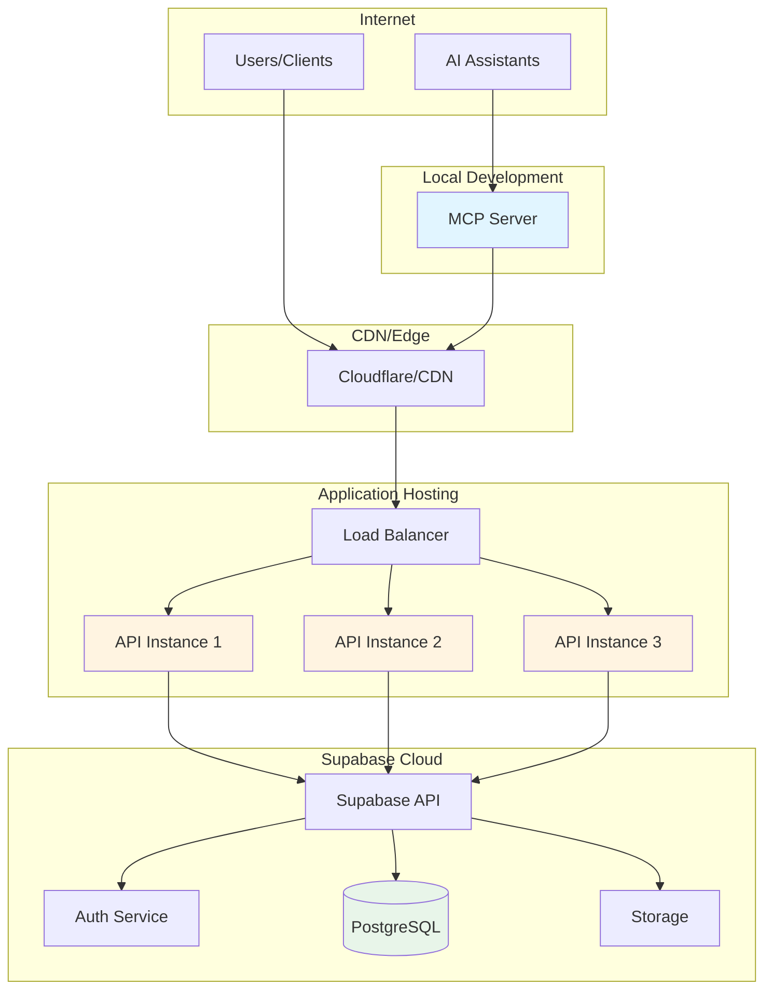
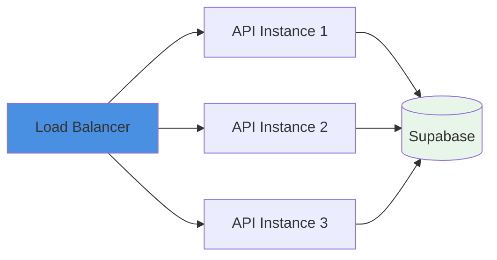

# Deployment Guide

## Overview

This guide covers deploying the Matchmaker system to production. The system has three deployable components:

1. **Backend API** - Deployed as a web service
2. **Supabase** - Managed service or self-hosted
3. **MCP Server** - Runs locally (not deployed)

## Deployment Architecture

### Production Architecture



## Deployment Options

### Option 1: Railway (Recommended for Quick Start)

**Pros:**
- Native Bun support
- One-click deployment from GitHub
- Automatic HTTPS
- Free tier available
- Simple environment variable management

**Cons:**
- Can be more expensive at scale
- Limited to their infrastructure

#### Railway Deployment Steps

1. **Create Railway Account**
   ```bash
   # Visit railway.app and sign up
   ```

2. **Install Railway CLI (Optional)**
   ```bash
   npm install -g @railway/cli
   railway login
   ```

3. **Deploy from GitHub**
   - Connect your GitHub repository
   - Select the `backend` directory as the root
   - Railway will auto-detect Bun

4. **Set Environment Variables**
   ```bash
   SUPABASE_URL=https://your-project.supabase.co
   SUPABASE_SERVICE_ROLE_KEY=your-service-role-key
   PORT=3000
   ```

5. **Deploy**
   - Push to main branch
   - Railway auto-deploys
   - Get your URL: `https://matchmaker-api.up.railway.app`

#### Railway Configuration (railway.json)

```json
{
  "$schema": "https://railway.app/railway.schema.json",
  "build": {
    "builder": "NIXPACKS",
    "buildCommand": "bun install"
  },
  "deploy": {
    "startCommand": "bun run start",
    "restartPolicyType": "ON_FAILURE",
    "restartPolicyMaxRetries": 10
  }
}
```

### Option 2: Render

**Pros:**
- Free tier with SSL
- Native Bun support
- Background workers support
- Easy database integration

**Cons:**
- Free tier spins down after inactivity
- Slower cold starts

#### Render Deployment Steps

1. **Create render.yaml**
   ```yaml
   services:
     - type: web
       name: matchmaker-api
       env: docker
       region: oregon
       plan: free
       buildCommand: bun install
       startCommand: bun run start
       envVars:
         - key: PORT
           value: 3000
         - key: SUPABASE_URL
           sync: false
         - key: SUPABASE_SERVICE_ROLE_KEY
           sync: false
   ```

2. **Connect GitHub**
   - Sign up at render.com
   - Connect repository
   - Render auto-detects configuration

3. **Set Environment Variables**
   - Add in Render dashboard
   - Mark sensitive vars as secret

### Option 3: Fly.io

**Pros:**
- Global edge deployment
- Free allowance
- Great for low-latency worldwide
- Native Bun support

**Cons:**
- More complex configuration
- CLI required

#### Fly.io Deployment Steps

1. **Install Fly CLI**
   ```bash
   curl -L https://fly.io/install.sh | sh
   flyctl auth login
   ```

2. **Initialize App**
   ```bash
   cd backend
   flyctl launch --no-deploy
   ```

3. **Configure fly.toml**
   ```toml
   app = "matchmaker-api"
   primary_region = "sjc"

   [build]
     [build.args]
       BUN_VERSION = "1.0.0"

   [env]
     PORT = "3000"

   [[services]]
     internal_port = 3000
     protocol = "tcp"

     [[services.ports]]
       handlers = ["http"]
       port = 80
       force_https = true

     [[services.ports]]
       handlers = ["tls", "http"]
       port = 443

   [http_service]
     internal_port = 3000
     force_https = true
     auto_stop_machines = true
     auto_start_machines = true
   ```

4. **Set Secrets**
   ```bash
   flyctl secrets set SUPABASE_URL=https://your-project.supabase.co
   flyctl secrets set SUPABASE_SERVICE_ROLE_KEY=your-key
   ```

5. **Deploy**
   ```bash
   flyctl deploy
   ```

### Option 4: Traditional VPS (DigitalOcean, AWS EC2, etc.)

**Pros:**
- Full control
- Predictable pricing
- Can run other services

**Cons:**
- Manual setup and maintenance
- Need to handle scaling
- Security updates on you

#### VPS Deployment Steps

1. **Setup Server**
   ```bash
   # Update system
   apt update && apt upgrade -y

   # Install Bun
   curl -fsSL https://bun.sh/install | bash

   # Install PM2 for process management
   npm install -g pm2

   # Install nginx
   apt install nginx -y
   ```

2. **Clone and Setup App**
   ```bash
   cd /var/www
   git clone your-repo
   cd matchmaker/backend
   bun install
   ```

3. **Create .env File**
   ```bash
   cat > .env << EOF
   SUPABASE_URL=https://your-project.supabase.co
   SUPABASE_SERVICE_ROLE_KEY=your-key
   PORT=3000
   EOF
   ```

4. **Setup PM2**
   ```bash
   pm2 start "bun run start" --name matchmaker-api
   pm2 save
   pm2 startup
   ```

5. **Configure Nginx**
   ```nginx
   server {
       listen 80;
       server_name api.yourdomain.com;

       location / {
           proxy_pass http://localhost:3000;
           proxy_http_version 1.1;
           proxy_set_header Upgrade $http_upgrade;
           proxy_set_header Connection 'upgrade';
           proxy_set_header Host $host;
           proxy_cache_bypass $http_upgrade;
           proxy_set_header X-Real-IP $remote_addr;
           proxy_set_header X-Forwarded-For $proxy_add_x_forwarded_for;
           proxy_set_header X-Forwarded-Proto $scheme;
       }
   }
   ```

6. **SSL with Let's Encrypt**
   ```bash
   apt install certbot python3-certbot-nginx -y
   certbot --nginx -d api.yourdomain.com
   ```

### Option 5: Docker Deployment

**Pros:**
- Consistent environments
- Works on any platform
- Easy local testing of production build

**Cons:**
- Overhead of containerization
- Need Docker knowledge

#### Dockerfile

```dockerfile
FROM oven/bun:1 AS base
WORKDIR /app

# Install dependencies
COPY package.json bun.lockb ./
RUN bun install --frozen-lockfile

# Copy application code
COPY . .

# Expose port
EXPOSE 3000

# Start application
CMD ["bun", "run", "start"]
```

#### docker-compose.yml (for local testing)

```yaml
version: '3.8'

services:
  api:
    build: ./backend
    ports:
      - "3000:3000"
    environment:
      - SUPABASE_URL=${SUPABASE_URL}
      - SUPABASE_SERVICE_ROLE_KEY=${SUPABASE_SERVICE_ROLE_KEY}
      - PORT=3000
    restart: unless-stopped
    healthcheck:
      test: ["CMD", "curl", "-f", "http://localhost:3000/health"]
      interval: 30s
      timeout: 10s
      retries: 3
      start_period: 40s
```

#### Deploy to Container Platform

```bash
# Build
docker build -t matchmaker-api ./backend

# Tag for registry
docker tag matchmaker-api your-registry/matchmaker-api:latest

# Push
docker push your-registry/matchmaker-api:latest

# Deploy to your platform (AWS ECS, GCP Cloud Run, Azure Container Apps)
```

## Supabase Deployment

### Option 1: Supabase Cloud (Recommended)

**Pros:**
- Fully managed
- Automatic backups
- Global CDN
- Free tier available
- Point-in-time recovery

**Cons:**
- Less control
- Vendor lock-in (mitigated by PostgreSQL compatibility)

#### Setup Steps

1. **Create Project**
   - Visit supabase.com
   - Create new project
   - Choose region close to your API

2. **Run Migrations**
   ```bash
   # Install Supabase CLI
   npm install -g supabase

   # Link to project
   supabase link --project-ref your-project-ref

   # Push migrations
   supabase db push
   ```

3. **Get Credentials**
   - Project URL: `https://your-project.supabase.co`
   - Service Role Key: Found in Settings > API

4. **Configure Auth**
   - Set up email provider or OAuth
   - Configure JWT expiration
   - Set allowed redirect URLs

### Option 2: Self-Hosted Supabase

**Pros:**
- Full control
- No vendor lock-in
- Can run on-premise

**Cons:**
- Complex setup
- Need to manage backups
- Need to handle scaling

#### Docker Compose Setup

```bash
# Clone Supabase
git clone --depth 1 https://github.com/supabase/supabase

# Navigate to docker directory
cd supabase/docker

# Copy env file
cp .env.example .env

# Edit .env with your configuration
nano .env

# Start services
docker compose up -d
```

## Environment Variables

### Production Environment Variables

```bash
# Required
SUPABASE_URL=https://your-project.supabase.co
SUPABASE_SERVICE_ROLE_KEY=your-service-role-key

# Optional
PORT=3000
NODE_ENV=production
```

### Security Best Practices

1. **Never commit secrets**
   - Add `.env` to `.gitignore`
   - Use platform secret management

2. **Rotate keys regularly**
   - Service role keys
   - JWT secrets
   - Database passwords

3. **Use environment-specific configs**
   - Different Supabase projects for dev/staging/prod
   - Different API keys per environment

## Database Migrations

### Running Migrations in Production

```bash
# Using Supabase CLI
supabase db push --linked

# Or manually via SQL editor in Supabase dashboard
```

### Migration Strategy

1. **Test locally first**
   ```bash
   supabase start
   supabase db reset
   ```

2. **Deploy to staging**
   ```bash
   supabase link --project-ref staging-project
   supabase db push
   ```

3. **Deploy to production**
   ```bash
   supabase link --project-ref prod-project
   supabase db push
   ```

### Rollback Strategy

```bash
# Create a new migration that reverses changes
supabase migration new rollback_feature_x

# Write SQL to undo changes
# Deploy the rollback migration
```

## Monitoring & Observability

### Health Checks

The API includes a health endpoint:

```bash
GET /health
Response: {"status":"healthy","timestamp":"2025-01-04T..."}
```

### Recommended Monitoring

1. **Application Monitoring**
   - UptimeRobot (free tier)
   - Pingdom
   - Datadog

2. **Error Tracking**
   - Sentry (recommended)
   - Rollbar
   - Bugsnag

3. **Logging**
   - Railway/Render/Fly.io built-in logs
   - Papertrail for aggregation
   - Logtail

4. **Database Monitoring**
   - Supabase dashboard (built-in)
   - PgHero for self-hosted

### Example Sentry Integration

```typescript
// Add to backend/src/index.ts
import * as Sentry from '@sentry/node'

if (process.env.SENTRY_DSN) {
  Sentry.init({
    dsn: process.env.SENTRY_DSN,
    environment: process.env.NODE_ENV,
    tracesSampleRate: 1.0,
  })
}
```

## Scaling Considerations

### Horizontal Scaling



**Stateless Design:**
- No session storage in API
- All state in database
- JWT for authentication
- Safe to scale horizontally

### Database Scaling

**Supabase Cloud:**
- Automatic connection pooling
- Read replicas (Pro plan)
- Point-in-time recovery

**Self-Hosted:**
- PgBouncer for connection pooling
- Read replicas for scaling reads
- Partitioning for large tables

### Performance Optimization

1. **Database Indexes** (already implemented)
   - `idx_people_matchmaker_id`
   - `idx_people_active`
   - `idx_introductions_matchmaker_id`
   - `idx_feedback_introduction_id`

2. **API Caching**
   ```typescript
   // Add caching middleware for read-heavy endpoints
   app.get('/api/people', cache({ maxAge: 60 }), async (c) => {
     // handler
   })
   ```

3. **Connection Pooling**
   - Supabase handles this automatically
   - For self-hosted, use PgBouncer

## CI/CD Pipeline

### GitHub Actions Example

```yaml
name: Deploy to Production

on:
  push:
    branches: [main]

jobs:
  deploy:
    runs-on: ubuntu-latest
    steps:
      - uses: actions/checkout@v3

      - uses: oven-sh/setup-bun@v1
        with:
          bun-version: latest

      - name: Install dependencies
        run: cd backend && bun install

      - name: Run tests
        run: cd backend && bun test

      - name: Deploy to Railway
        run: |
          npm install -g @railway/cli
          railway up --service matchmaker-api
        env:
          RAILWAY_TOKEN: ${{ secrets.RAILWAY_TOKEN }}

      - name: Run database migrations
        run: |
          npm install -g supabase
          supabase link --project-ref ${{ secrets.SUPABASE_PROJECT_REF }}
          supabase db push
        env:
          SUPABASE_ACCESS_TOKEN: ${{ secrets.SUPABASE_ACCESS_TOKEN }}
```

## Zero-Downtime Deployment

### Strategy

1. **Health checks**
   - Platform waits for `/health` to return 200
   - Keeps old instance running until new is healthy

2. **Rolling deployment**
   - Deploy to one instance at a time
   - Wait for health check
   - Move to next instance

3. **Database migrations**
   - Backward-compatible migrations
   - Deploy code that works with both old and new schema
   - Run migration
   - Deploy code that uses new schema

## Backup Strategy

### Database Backups (Supabase Cloud)
- **Automatic daily backups** (included)
- **Point-in-time recovery** (Pro plan)
- **Manual backups** via dashboard

### Database Backups (Self-Hosted)

```bash
# Automated backup script
#!/bin/bash
TIMESTAMP=$(date +%Y%m%d_%H%M%S)
BACKUP_DIR="/backups"
DB_NAME="postgres"

# Create backup
docker exec supabase-db pg_dump -U postgres $DB_NAME | gzip > $BACKUP_DIR/backup_$TIMESTAMP.sql.gz

# Keep last 30 days
find $BACKUP_DIR -name "backup_*.sql.gz" -mtime +30 -delete

# Upload to S3 (optional)
aws s3 cp $BACKUP_DIR/backup_$TIMESTAMP.sql.gz s3://your-bucket/backups/
```

### Cron Job

```bash
# Run daily at 2 AM
0 2 * * * /usr/local/bin/backup-db.sh
```

## Disaster Recovery

### Recovery Time Objective (RTO)
- **Target**: < 1 hour
- **Strategy**: Keep infrastructure as code
- **Runbook**: Documented in this file

### Recovery Point Objective (RPO)
- **Target**: < 1 hour of data loss
- **Strategy**: Hourly backups or point-in-time recovery

### Recovery Steps

1. **API Down**
   - Check platform status
   - Review logs
   - Rollback to previous version if needed
   - Scale up instances if capacity issue

2. **Database Corruption**
   - Restore from latest backup
   - Apply migrations since backup
   - Verify data integrity

3. **Complete Infrastructure Loss**
   - Provision new infrastructure
   - Restore database from backup
   - Deploy latest code
   - Update DNS
   - Verify all systems

## Cost Estimation

### Typical Production Stack

| Service | Tier | Monthly Cost |
|---------|------|--------------|
| Railway (API) | Starter | $5-20 |
| Supabase | Pro | $25 |
| Domain | - | $12/year |
| Monitoring (Sentry) | Free/Team | $0-26 |
| **Total** | | **$30-71/month** |

### Alternative Stack (Lower Cost)

| Service | Tier | Monthly Cost |
|---------|------|--------------|
| Render (API) | Free | $0 |
| Supabase | Free | $0 |
| Domain | - | $12/year |
| **Total** | | **$1/month** |

*Note: Free tiers have limitations (cold starts, compute limits, etc.)*

## Security Checklist

- [ ] Environment variables stored securely
- [ ] HTTPS enabled (enforced)
- [ ] CORS configured properly
- [ ] Rate limiting enabled (via Supabase)
- [ ] JWT tokens expiring appropriately
- [ ] Database RLS policies tested
- [ ] Secrets rotated regularly
- [ ] Backups tested and verified
- [ ] Monitoring and alerting configured
- [ ] Error tracking enabled
- [ ] Security headers configured
- [ ] DDoS protection enabled (via Cloudflare)

## MCP Server Deployment

**Important**: The MCP server is **not deployed** to production. It runs locally on developer machines or in AI assistant environments.

### Local Setup

```bash
cd mcp-server
bun install
bun run build

# Configure in AI assistant (e.g., Claude Desktop)
# Add to config file
```

### Configuration

```json
{
  "mcpServers": {
    "matchmaker": {
      "command": "bun",
      "args": ["run", "/path/to/matchmaker/mcp-server/build/index.js"],
      "env": {
        "MATCHMAKER_API_URL": "https://your-api.railway.app",
        "MATCHMAKER_AUTH_TOKEN": "your-jwt-token"
      }
    }
  }
}
```

## Post-Deployment Checklist

- [ ] API accessible via public URL
- [ ] Health endpoint returning 200
- [ ] Database migrations applied
- [ ] Environment variables set correctly
- [ ] Authentication working
- [ ] CORS allowing intended origins
- [ ] Error tracking receiving errors
- [ ] Monitoring showing metrics
- [ ] Logs accessible
- [ ] Backups running
- [ ] DNS configured
- [ ] SSL certificate valid
- [ ] Load testing completed (optional)
- [ ] Documentation updated with URLs
