# Interaction Flows & Sequence Diagrams

## Overview

This document illustrates how different components of the Matchmaker system interact during common operations.

## Authentication Flows

### User Sign Up & First Login


### Subsequent Login


### Token Refresh


## People Management Flows

### Creating a Person


### Listing People


### Updating a Person


### Soft Delete Person


## Introduction Flows

### Creating an Introduction

```mermaid
sequenceDiagram
    participant Matchmaker
    participant API
    participant Database
    participant Check Constraint

    Matchmaker->>API: POST /api/introductions<br/>{person_a_id, person_b_id}
    API->>Database: Verify person_a exists<br/>and belongs to matchmaker
    Database-->>API: Person A confirmed

    API->>Database: Verify person_b exists<br/>and belongs to matchmaker
    Database-->>API: Person B confirmed

    API->>Database: INSERT INTO introductions
    Database->>Check Constraint: Validate person_a_id ≠ person_b_id

    alt Constraint passes
        Database->>Database: Check RLS (matchmaker_id = userId)
        Database-->>API: Introduction created
        API-->>Matchmaker: 201 Created
    else Same person
        Check Constraint-->>API: Constraint violation
        API-->>Matchmaker: 500 Error
    end
```



### Introduction Lifecycle


### Alternative: Introduction Declined


## Feedback Flows

### Adding Feedback After a Date


### Viewing Feedback for Introduction


## Matching Algorithm Flow


### Future Matching Algorithm Detail


## MCP Server Flows

### AI Assistant Creating a Person via MCP


### AI Assistant Listing People via MCP


### MCP Configuration Flow


## Error Handling Flows

### Invalid JWT Token


### Missing Authorization Header


### Validation Error


### Database Error

```mermaid
sequenceDiagram
    participant Client
    participant API
    participant Database

    Client->>API: POST /api/people<br/>{valid data}
    API->>Database: INSERT INTO people

    Database->>Database: Connection lost / Error

    Database-->>API: Error
    API->>API: Catch error
    API-->>Client: 500 Internal Server Error<br/>{error: "Error message"}

    Note over API: Error logged for debugging
```

### RLS Policy Violation

```mermaid
sequenceDiagram
    participant Matchmaker A
    participant API
    participant Database

    Note over Matchmaker A: Trying to access<br/>Matchmaker B's data

    Matchmaker A->>API: GET /api/people/:id<br/>(person belongs to Matchmaker B)
    API->>Database: SELECT * FROM people<br/>WHERE id = :id<br/>AND matchmaker_id = userId

    Database->>Database: Apply RLS policy

    Note over Database: No rows match<br/>(wrong matchmaker)

    Database-->>API: Empty result
    API-->>Matchmaker A: 404 Not Found

    Note over Matchmaker A,Database: RLS prevents unauthorized access<br/>at database level
```

## Data Flow Summary

### Complete CRUD Flow for People

```mermaid
graph TB
    START[Client Request] --> AUTH{Valid JWT?}
    AUTH -->|No| ERROR1[401 Unauthorized]
    AUTH -->|Yes| OPERATION{Operation}

    OPERATION -->|CREATE| VALIDATE_CREATE[Validate Input]
    OPERATION -->|READ| DB_READ[Query Database]
    OPERATION -->|UPDATE| VALIDATE_UPDATE[Validate Input]
    OPERATION -->|DELETE| DB_DELETE[Soft Delete]

    VALIDATE_CREATE -->|Invalid| ERROR2[400 Bad Request]
    VALIDATE_CREATE -->|Valid| DB_INSERT[Insert to DB]

    DB_INSERT --> RLS_INSERT{RLS Check}
    RLS_INSERT -->|Pass| SUCCESS1[201 Created]
    RLS_INSERT -->|Fail| ERROR3[500 Error]

    DB_READ --> RLS_READ{RLS Filter}
    RLS_READ --> SUCCESS2[200 OK]

    VALIDATE_UPDATE -->|Invalid| ERROR4[400 Bad Request]
    VALIDATE_UPDATE -->|Valid| DB_UPDATE[Update in DB]

    DB_UPDATE --> RLS_UPDATE{RLS Check}
    RLS_UPDATE -->|Pass & Found| TRIGGER[Update Trigger]
    RLS_UPDATE -->|Not Found| ERROR5[404 Not Found]

    TRIGGER --> SUCCESS3[200 OK]

    DB_DELETE --> RLS_DELETE{RLS Check}
    RLS_DELETE -->|Pass & Found| SUCCESS4[200 OK]
    RLS_DELETE -->|Not Found| ERROR6[404 Not Found]

    style START fill:#e1f5ff
    style SUCCESS1 fill:#c8e6c9
    style SUCCESS2 fill:#c8e6c9
    style SUCCESS3 fill:#c8e6c9
    style SUCCESS4 fill:#c8e6c9
    style ERROR1 fill:#ffcdd2
    style ERROR2 fill:#ffcdd2
    style ERROR3 fill:#ffcdd2
    style ERROR4 fill:#ffcdd2
    style ERROR5 fill:#ffcdd2
    style ERROR6 fill:#ffcdd2
```

## Performance Flow

### Request Lifecycle with Timing

```mermaid
sequenceDiagram
    participant Client
    participant API
    participant Auth
    participant Validator
    participant Database

    Note over Client,Database: Typical request: 50-150ms

    Client->>API: Request (0ms)
    Note over API: Middleware: 1-5ms
    API->>Auth: Validate JWT (5ms)
    Auth->>Auth: Supabase Auth check (20-50ms)
    Auth-->>API: Valid (55ms)

    API->>Validator: Validate input (60ms)
    Note over Validator: Zod validation: 1-2ms
    Validator-->>API: Valid (62ms)

    API->>Database: Query (62ms)
    Note over Database: Query execution: 10-50ms<br/>Includes RLS evaluation
    Database-->>API: Results (112ms)

    API-->>Client: Response (115ms)

    Note over Client,Database: Total: ~115ms<br/>(Varies based on network,<br/>database load, query complexity)
```

## Concurrent Operations

### Multiple Clients Accessing Same Data

```mermaid
sequenceDiagram
    participant Client A
    participant Client B
    participant API
    participant Database

    Note over Client A,Database: Both clients updating<br/>same person

    Client A->>API: PUT /api/people/:id {age: 28}
    Client B->>API: PUT /api/people/:id {location: "NYC"}

    par Concurrent Updates
        API->>Database: UPDATE (age: 28)
        API->>Database: UPDATE (location: "NYC")
    end

    Note over Database: PostgreSQL handles<br/>concurrent updates with MVCC

    Database-->>API: Success (age: 28)
    Database-->>API: Success (location: "NYC")

    API-->>Client A: 200 OK
    API-->>Client B: 200 OK

    Note over Database: Final state:<br/>age: 28, location: "NYC"<br/>(Last write wins for each field)
```

This documentation provides a comprehensive view of how the Matchmaker system processes requests, handles data, and ensures security through its various layers.
